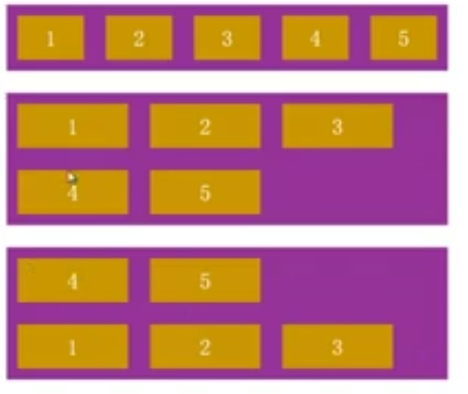
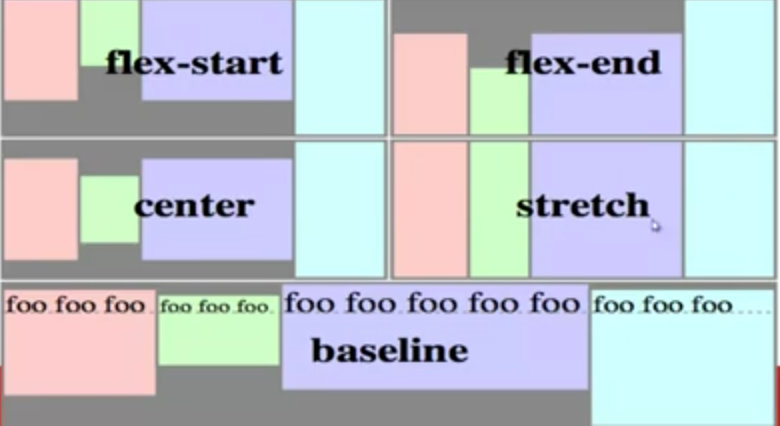

<!-- START doctoc generated TOC please keep comment here to allow auto update -->
<!-- DON'T EDIT THIS SECTION, INSTEAD RE-RUN doctoc TO UPDATE -->
**Table of Contents**  *generated with [DocToc](https://github.com/thlorenz/doctoc)*

- [布局](#%E5%B8%83%E5%B1%80)
  - [display](#display)
    - [display:block](#displayblock)
    - [display:inline](#displayinline)
    - [display:inline-block](#displayinline-block)
    - [display:none](#displaynone)
  - [position](#position)
    - [position:relative](#positionrelative)
    - [position:absolute](#positionabsolute)
    - [position:fixed](#positionfixed)
    - [top/right/bottom/left](#toprightbottomleft)
    - [z-index](#z-index)
  - [float](#float)
    - [清除浮动](#%E6%B8%85%E9%99%A4%E6%B5%AE%E5%8A%A8)
  - [flex](#flex)
    - [flex 方向](#flex-%E6%96%B9%E5%90%91)
    - [flex 弹性](#flex-%E5%BC%B9%E6%80%A7)
    - [flex 对齐](#flex-%E5%AF%B9%E9%BD%90)

<!-- END doctoc generated TOC please keep comment here to allow auto update -->

### 布局

学习布局前须知道 CSS 中的定位机制。

- 标准文档流（Normal Flow）
- 浮动（Float）
- 绝对定位（Absolute Positioning)

**标准文档流**，从上到下，从左到右的输出文档内容。它由*块级*（block）元素和*行级*元素组成，且它们都是盒子模型。

下面为 Firefox 布局可视化 **Gecko Reflow Visualisation**，布局是指浏览器将元素以正确的大小摆放在正确的位置上。


#### display

设置元素的显示方式

|display|默认宽度|可设置宽高|起始位置|
|-------|--------|----------|--------|
|block|父元素宽度|是|换行|
|inline|内容宽度|否|同行|
|inline-block|内容宽度|是|同行|

##### display:block

设置元素为块级元素

- 默认宽高为父元素宽高
- 可设置宽高
- 换行显示
- 默认display属性为block的元素：div, p, h1-h6, ul, form ...

```html
<!DOCTYPE html>
<html>
<head>
	<meta charset="UTF-8">
	<title>display block</title>
	<style>
		span{background-color: green}
		.sample{background-color: pink}
		/* 可设置宽高 */
		/*.sample{width: 200px;height: 200px;}*/
	</style>
</head>
<body>
	<span>before block</span>
	<!-- div块本身就是块级元素 -->
	<div class="sample">display:block;</div>
	<span>after block</span>
</body>
</html>
```

##### display:inline

设置元素为行级元素

- 默认宽度为内容宽度
- 不可设置宽高
- 同行显示。当元素
- 默认display属性为inline的元素：span, a, label, cite, em...

```html
<!DOCTYPE html>
<html>
<head>
	<meta charset="UTF-8">
	<title>2.display inline</title>
	<style>
		.sample{background-color: pink}
		/* 不可设置宽高，下面这行设置是无效的设置 */
		/*.sample{width: 200px;height: 200px;}*/
		/*em{display: block;}*/
	</style>
</head>
<body>
	<span>before inline</span>
	<span class="sample">display:inline;</span>
	<em>after inline</em>
</body>
</html>
```

##### display:inline-block

设置元素为行级块元素（结合了块级元素和行级元素的特征）

- 默认宽度为内容宽度
- 可设置宽高
- 同行显示
- 当同一行的行级块元素元素超过了容器的宽度，这个行级块元素会整块换行
- 默认display属性为inline-block的元素：input, textarea, select, button ...

```html
<!DOCTYPE html>
<html>
<head>
	<meta charset="UTF-8">
	<title>3.display inline-block</title>
	<style>
		.sample{background-color: pink}
		.sample{display: inline-block;}
		/* 可设置内容宽高 */
		.sample{width: 200px;height: 200px;}
		.sample{vertical-align: middle;}  //有疑问MARK
		/* 当行级块元素元素超过了容器的宽度，块级元素换行 */
		/*body{
			width: 340px;
		}*/
	</style>
</head>
<body>
	<span>before inline-block</span>
	<span class="sample">display:inline-block;</span>
	<em>after inline-block</em>
</body>
</html>
```

##### display:none

- 设置元素不显示

`display:none` 与 `visibility:hidden` 的区别为 `display:none` 不显示且不占位，但 `visibility:hidden` 不显示但占位。

|特点|元素|
|---|---|
|默认display属性为block的元素|div, p, h1-h6, ul, form|
|默认display属性为inline的元素|span, a, label, cite, em|
|默认display属性为inline-block的元素|input, textarea, select, button|

#### position

`position` 用于设置定位的方式。而`top` `right` `bottom` `left` `z-index` 属性则用于设置元素相对于参照物的位置（5个属性必须配合position一同使用）。

**三种定位形式**

- 静态定位（static）
- 相对定位（relative）
- 绝对定位（absolute、fixed）

```
/* 默认值为 static */
position: static | relative | absolute | fixed
```

- static：没有定位，元素出现在正常的流中（忽略 top, bottom, left, right 或者 z-index 声明）
- relative：相对定位
- absolute：绝对定位
- fixed：固定定位

|类型|默认宽度|是否存在于文档流|参照对象|
|---|---|---|---|
|relative|父元素宽度|存在|自身|
|absolute|内容宽度|不存在|父级元素或HTML元素|
|fixed|内容宽度|不存在|视窗|

##### position:relative

设置元素为相对定位方式

- 默认是父元素宽度
- 相对定位的元素仍在文档流之中，并按照文档流中的顺序进行排列
- 参照物为元素本身的位置

```HTML
<!DOCTYPE html>
<html>
<head>
	<meta charset="UTF-8">
	<title>相对定位</title>
	<style>
		.container{width: 400px;line-height: 2;border: 1px dashed #aaa;}
		.sample{background-color: pink;}
		/*.sample{position: relative;}*/
		/*.sample{top: 20px;left: 30px;}*/
	</style>
</head>
<body>
	<div class="container">
		<div>相对定位元素的前序元素</div>
		<div class="sample">sample</div>
		<div>相对定位元素的后序元素</div>
	</div>
</body>
</html>
```

NOTE：最常用于改变元素层级和设置为绝对定位的参照物(如果不懂，去看“布局position”那个视频的15:25-18:29部分)。


##### position:absolute

设置元素为绝对定位方式

- 默认宽度为内容宽度
- 脱离文档流
- 参照物为第一个定位祖先或根元素（HTML 元素）（通常就用一个relative的元素来做absolute的参照物⬆️）

```html
<!DOCTYPE html>
<html>
<head>
	<meta charset="UTF-8">
	<title>绝对定位</title>
	<style>
		.container{width: 300px;margin: 50px;line-height: 2;border: 1px dashed #aaa;}
		.sample{background-color: pink;}
		/*.sample{position: absolute;}*/
		/*.sample{bottom: 10px;left: -30px;}*/
		/*.container{position: relative;} //以这个元素作为绝对定位的参照物*/
	</style>
</head>
<body>
	<div class="container">
		<div>绝对定位元素的前序元素</div>
		<div class="sample">sample</div>
		<div>绝对定位元素的后序元素</div>
	</div>
</body>
</html>
```


##### position:fixed

设置元素为固定定位方式

- 默认宽度为内容宽度
- 脱离文档流
- 参照物为视窗

```html
<!DOCTYPE html>
<html>
<head>
	<meta charset="UTF-8">
	<title>fixed定位</title>
	<style>
		.container{width: 400px;margin: 200px;line-height: 2;border: 1px dashed #aaa;}
		.sample{background-color: pink;}
		/*.sample{position: fixed;}*/
		/*.sample{bottom: 0;left: 10px;}*/
		/*.container{height: 1000px;}	*/
	</style>
</head>
<body>
	<div class="container">
		<div>绝对定位元素的前序元素</div>
		<div class="sample">sample</div>
		<div>绝对定位元素的后序元素</div>
	</div>
</body>
</html>
```

NOTE：宽高的100%的参照依然为视窗（例：网页遮罩效果）


##### top/right/bottom/left


其用于设置元素边缘与参照物边缘的距离，且设置的值可为负值。在同时设置相对方向时，元素将被拉伸。

##### z-index

其用于设置 Z 轴上的排序，默认值为 0 但可设置为负值，数字大的在上面。（如不做设置，则按照文档流的顺序排列。后面的元素将置于前面的元素之上）


###### z-index 栈

父类容器的 `z-index` 优于子类 `z-index` 如图


#### float

CSS 中规定的定位机制，其可实现块级元素同行显示并存在于文档流之中。浮动仅仅影响文档流中下一个紧邻的元素。

```
float: left | right | none | inherit
```

- 默认宽度为内容宽度
- 脱离文档流（会被父元素边界阻挡与`position`脱离文档流的方式不同）
- 指的方向一直移动


**float 元素在同一文档流中**，当同时进行 `float` 时它们会按照文档流中的顺序排列。(当所有父元素中的所有元素脱离文档流之后，父元素将失去原有默认的内容高度)


注意：**float 元素是半脱离文档流的**，对元素是脱离文档流，但对于内容则是在文档流之中的（既元素重叠但内容不重叠）。


##### 清除浮动

```
clear: both | left | right | none | inherit
```

- 应用于后续元素
- 应用于块级元素（block）

**关键代码**

```
/* clearfix */
.clearfix:after {
   content: "."; /* Older browser do not support empty content */
   visibility: hidden;
   display: block;
   height: 0;
   clear: both;
}
.clearfix {zoom: 1;} /* 针对 IE 不支持 :after */
```

**使用方法**

1. 编写清除浮动CSS：`.clearfix:after`
2. 将清除浮动的class类`clearfix` 用于父元素上

```
<!DOCTYPE html>
<html>
<head>
	<meta charset="UTF-8">
	<title>float obscure</title>
	<style>
		body{width: 400px;line-height: 1.6;}
		.sample{width: 100px;line-height: 100px;margin: 3px;text-align: center;background-color: pink;}
		.sb{margin: 10px auto;padding: 5px;border: 1px dashed #0f00fa;}
		.sample{float: left;}
		/*.clearfix:after{content:'.';display: block;clear: both;height: 0;overflow: hidden;visibility: hidden;}*/
		/*.clearfix {zoom: 1;}  //针对 IE 不支持 :after */
	</style>
</head>
<body>
	<div class="sb clearfix">
		<div id="p1" class="sample">float: left;</div>
		第12届ChinaJoy动漫游戏展7月31日在上海新国际博览中心开幕，到处是站台表演的帅哥美女。
	</div>
	<div id="p2" class="sb">
		有些游戏商为了吸引人气，还请来了著名的演员、模特前来助阵。以下是一批漂亮的Show Girl现场照片。
	</div>
</body>
</html>
```
上面的例子清除了id为p1的元素浮动给id为p2元素造成的影响。

#### flex


弹性布局可用于多行自适应，多列自适应，间距自适应和任意对齐。

**创建 flex container**

创建flex container元素，只需将元素的display属性设置为flex即可，弹性容器内的直接子元素均为弹性元素（**flex item**）。

NOTE：只有弹性容器在文档流中的子元素才属于弹性元素，弹性容器子元素的后台元素不是弹性元素。

```html
<div style="display: flex;">
  <div>Block Element</div>   <!-- flex item: YES-->
  <div style="float:left">float</div> <!-- flex item: YES-->
  <span>Inline Element</span>   <!-- flex item: YES-->
  <div style="position:absolute;">Absolute Block Element</div>   <!-- flex item: NO-->
  <div>
    <!-- 这个div不是子元素，而是后代元素，因此也不是flex item -->
  	<div>grandson</div> <!-- flex item: NO  -->
  </div>
</div>
```

##### flex 方向

###### flex-direction

`flex-direction: row（默认） | row-reverse | column | column-reverse`

设置弹性的方向。

- row：从左到右（图左一）
- row-reverse：从右到左（图左二）
- column：从上到下（图左三）
- column-reverse：从下往上（图左四）


```html
<!DOCTYPE html>
<html>
<head>
	<meta charset="UTF-8">
	<title>flex direction</title>
	<style>
		.container{margin: 20px;line-height: 40px;font-size: 20px;color: #fff;background-color: #963297;}
		.item{margin: 10px;line-height: 40px;text-align: center;background-color: #c99702;}
		.container0 .item, .container1 .item{padding: 0 12px;}
		/* 关键代码 */
		.container{display: flex;}
		.container1{flex-direction: row-reverse;}
		.container2{flex-direction: column}
		.container3{flex-direction: column-reverse}
	</style>
</head>
<body>
	<div class="container container0">
	  <div class="item">1</div>
	  <div class="item">2</div>
	  <div class="item">3</div>
	</div>
	<div class="container container1">
	  <div class="item">1</div>
	  <div class="item">2</div>
	  <div class="item">3</div>
	</div>
	<div class="container container2">
	  <div class="item">1</div>
	  <div class="item">2</div>
	  <div class="item">3</div>
	</div>
	<div class="container container3">
	  <div class="item">1</div>
	  <div class="item">2</div>
	  <div class="item">3</div>
	</div>
</body>
</html>
```

###### flex-wrap

`flex-wrap: nowrap（默认） | wrap | wrap-reverse`

- nowrap：默认值，设置不换行。
- wrap：设置换行（图左二）
- wrap-reverse：反向换行（图左三）



```html
<!DOCTYPE html>
<html>
<head>
	<meta charset="UTF-8">
	<title>flex wrap</title>
	<style>
		.container{width: 400px;margin: 20px;line-height: 40px;font-size: 20px;color: #fff;background-color: #963297;}
		.item{margin: 10px;width: 100px;line-height: 40px;text-align: center;background-color: #c99702;}
		/* 关键代码 */
		.container{display: flex;}
		.container1{flex-wrap: wrap;}
		.container2{flex-wrap: wrap-reverse;}
	</style>
</head>
<body>
	<div class="container container0">
	  <div class="item">1</div>
	  <div class="item">2</div>
	  <div class="item">3</div>
	  <div class="item">4</div>
	  <div class="item">5</div>
	</div>
	<div class="container container1">
	  <div class="item">1</div>
	  <div class="item">2</div>
	  <div class="item">3</div>
	  <div class="item">4</div>
	  <div class="item">5</div>
	</div>
	<div class="container container2">
	  <div class="item">1</div>
	  <div class="item">2</div>
	  <div class="item">3</div>
	  <div class="item">4</div>
	  <div class="item">5</div>
	</div>
</body>
</html>
```

###### flex-flow

`flex-flow: <'flex-direction'> || <'flex-wrap'>`

`flex-flow` 为 `flex-wrap` 与 `flex-direction` 的简写，建议使用此属性（避免同时使用两个属性来修改）。


```html
<!DOCTYPE html>
<html>
<head>
	<meta charset="UTF-8">
	<title>flex wrap</title>
	<style>
		.container{width: 400px;margin: 20px;line-height: 40px;font-size: 20px;color: #fff;background-color: #963297;}
		.item{margin: 10px;width: 100px;line-height: 40px;text-align: center;background-color: #c99702;}
		/* 关键代码 */
		.container{display: flex;}
		.container1{height: 200px; flex-flow: column wrap;}
		.container2{flex-flow: row-reverse wrap-reverse;}
	</style>
</head>
<body>
	<div class="container container0">
	  <div class="item">1</div>
	  <div class="item">2</div>
	  <div class="item">3</div>
	  <div class="item">4</div>
	  <div class="item">5</div>
	</div>
	<div class="container container1">
	  <div class="item">1</div>
	  <div class="item">2</div>
	  <div class="item">3</div>
	  <div class="item">4</div>
	  <div class="item">5</div>
	</div>
	<div class="container container2">
	  <div class="item">1</div>
	  <div class="item">2</div>
	  <div class="item">3</div>
	  <div class="item">4</div>
	  <div class="item">5</div>
	</div>
</body>
</html>
```

###### order 顺序

`order: <integer>（默认为0）`

设置元素的排列顺序。`order` 的值为相对的，值越小，排得越前。如果所有元素均未设置，则按照文档流中的顺序排列。

```html
<!DOCTYPE html>
<html>
<head>
	<meta charset="UTF-8">
	<title>order</title>
	<style>
		.container{float: left;background-color: #963297;}
		.item{margin: 10px;width: 100px;line-height: 40px;text-align: center;color: #fff;font-size: 20px;background-color: #c99702;}
		/* 关键代码 */
		.container{display: flex;}
		.item1{order: 1;}
		.item2{order: 10;}
		.item3{order: -1;}
	</style>
</head>
<body>
	<div class="container">
	  <div class="item item1">1</div>
	  <div class="item item2">2</div>
	  <div class="item item3">3</div>
	</div>
</body>
</html>
```

##### flex 弹性

###### flex-basis

`flex-basis: main-size（默认值，主轴宽度） | <width>`

设置 `flex-item` 的初始宽或高（并作为弹性的基础）。如果 `flex-direction` 是以 `row` 排列则`flex-item`设置的是**宽**，如以 `column` 排列则`flex-item`设置的是**高**。

```html
.item{width: 100px;}
.item2{flex-basis: 300px;}
<div class="container">
  <div class="item item1">1</div> <!-- 大小为100px -->
  <div class="item item2">2</div> <!-- 大小为300px = flex-basis设置大小 -->
  <div class="item item3">3</div> <!-- 大小为100px -->
</div>
```

###### flex-grow

`flex-grow: <number>（默认为0）`

设置伸展因子。伸展因子其为弹性布局中最重要的元素之一，`flex-grow` 设置元素可用空余空间的比例。   

NOTE：`flex-container` 先安装宽度（`flex-basis`）进行布局，如果有空余空间就按照 `flex-grow` 中的比例进行分配。

**Width/Height = flex-basis + flex-grow/sum(flow-grow) * remain**

```html
<!DOCTYPE html>
<html>
<head>
	<meta charset="UTF-8">
	<title>flex-grow</title>
	<style>
		.container{background-color: #963297; width: 600px;}
		.item{margin: 10px;line-height: 40px;text-align: center;color: #fff;font-size: 20px;background-color: #c99702;}
		.container{display: flex;}
		.item{width: 100px;}
		/*.item2{flex-basis: 300px;}*/
		/*.item2{flex-grow: 1;}*/
		/*.item3{flex-grow: 2;}*/
		/*.item2, .item3{flex-basis: 0;}*/
	</style>
</head>
<body>
	<div class="container">
	  <div class="item item1">1</div>
	  <div class="item item2">2</div>
	  <div class="item item3">3</div>
	</div>
</body>
</html>
```

###### flex-shrink

`flex-shrink: <number>（默认值为1）`

设置收缩因子。用于分配超出的负空间如何从可用空间中进行缩减。

**Width/Height = flex-basis + flow-shrink/sum(flow-shrink) * remain**

remain 为负值，既超出的区域。

```html
<!DOCTYPE html>
<html>
<head>
	<meta charset="UTF-8">
	<title>flex-shink</title>
	<style>
		.container{width: 600px;background-color: #963297;}
		.item{margin: 10px;line-height: 40px;text-align: center;color: #fff;font-size: 20px;background-color: #c99702;}
		.container{display: flex;}
		/*.item{flex-shrink: 0;}*/
		.item2{flex-shrink: 2;}   
	</style>
</head>
<body>
	<div class="container">
	  <div class="item item1">sets the flex shrink factor</div>
	  <div class="item item2">sets the flex shrink factor</div>
	  <div class="item item3">sets the flex shrink factor</div>
	</div>
</body>
</html>
```

###### flex

`flex: <'flex-grow'>（默认为0） || <'flex-shrink'>（默认为1） || <'flex-basis'>（默认为main-size）`

其为 `flex-grow` `flex-shrink` `flex-basis` 的值缩写。

```html
<!DOCTYPE html>
<html>
<head>
	<meta charset="UTF-8">
	<title>flex</title>
	<style>
		.container{background-color: #963297;}
		.item{margin: 10px;line-height: 40px;text-align: center;color: #fff;font-size: 20px;background-color: #c99702;}
		.container{display: flex;flex-flow: column;}
		html, body, .container{height: 100%;}
		.item{flex: 1 1 0;}
		.item3{flex: 2;}
	</style>
</head>
<body>
	<div class="container">
	  <div class="item item1">1</div>
	  <div class="item item2">2</div>
	  <div class="item item3">3</div>
	</div>
</body>
</html>
```

##### flex 对齐

###### justify-content 主轴对齐方式

`justify-content: flex-start（默认） | flex-end | center | space-between | space-around`

其用于设置主轴（main-axis）上的对其方式。弹性元素根据主轴（横向和纵向均可）定位。所以不可使用 `left` 与 `right` 因为位置为相对的。

- flex-start：从左到右（从上到下）布局
- flex-end：从右到左（从下到上）布局
- center：居中对齐
- space-between：平分空间
- space-around：环绕，类似于text-aglin


###### align-items 辅轴对齐方式

`align-items: flex-start | flex-end | center | baseline | stretch（默认值）`

其用于设置辅轴（cross-axis）上的对其方式，其语法与`justify-content`类似

- flex-start：从左到右（从上到下）布局（居左或居上对齐）
- flex-end：从右到左（从下到上）布局（居右或居下对齐）
- center：居中对齐
- baseline：基线对齐（与vertical-align类似）
- stretch：延展充满辅轴



###### align-self 辅轴对齐方式

`align-self: auto（默认）) | flex-start | flex-end | center | baseline | stretch`

其用于设置单个 `flex-item` 在 辅轴（cross-axis） 方向上的对其方式。

```html
<!DOCTYPE html>
<html>
<head>
	<meta charset="UTF-8">
	<title>align-self</title>
	<style>
		.container{margin: 20px;line-height: 40px;font-size: 20px;color: #fff;background-color: #963297;}
		.item{margin: 10px;width: 100px;line-height: 40px;text-align: center;background-color: #c99702;}
		/* 关键代码 */
		.container{display: flex;align-items: flex-start;}
		.item1{line-height: 100px;}
		/*.item2{align-self: flex-end;}*/
		/*.item2{align-self: center;}*/
		/*.item2{align-self: baseline;}*/
		/*.item2{align-self: stretch;}*/
	</style>
</head>
<body>
	<div class="container">
	  <div class="item item1">1</div>
	  <div class="item item2">2</div>
	  <div class="item item3">3</div>
	</div>
</body>
</html>
```

###### align-content 辅轴多行对齐方式

`align-content:flex-start | flex-end | center | space-between | space-around | stretch（默认）`

用于设置辅轴（cross-axis）方向上多行的对齐方式。

