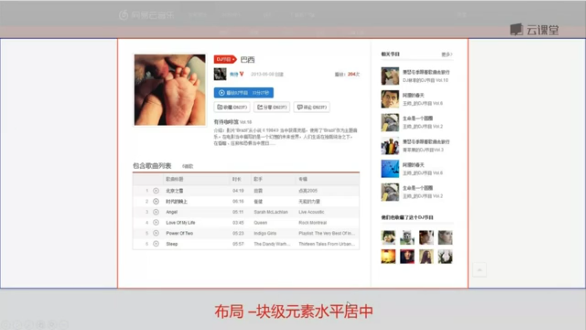
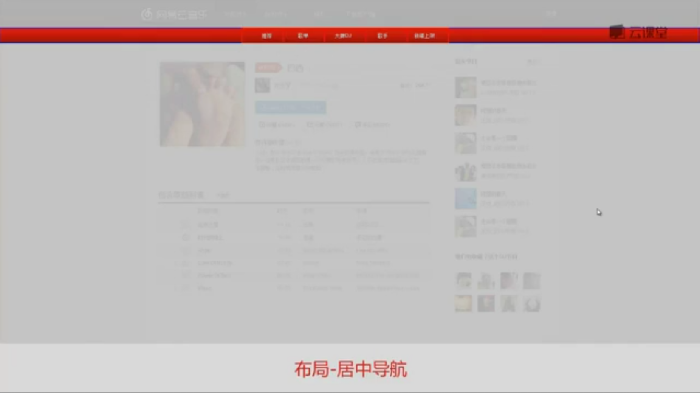
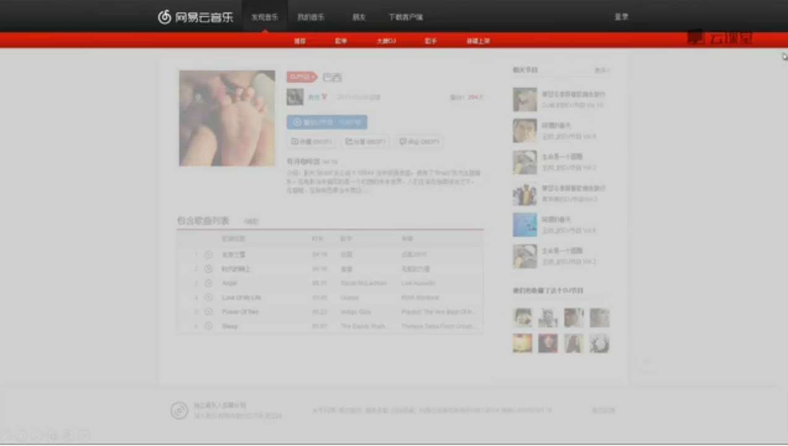
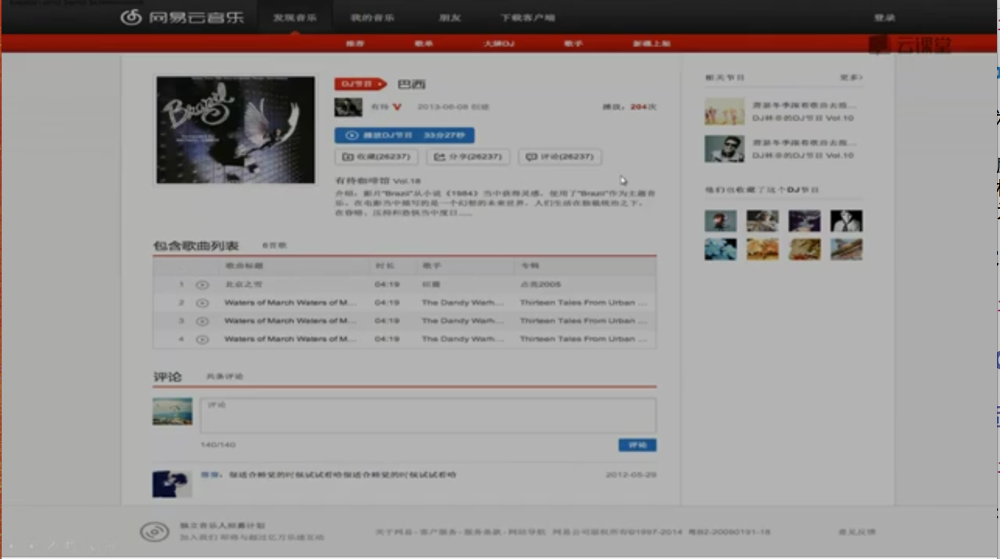
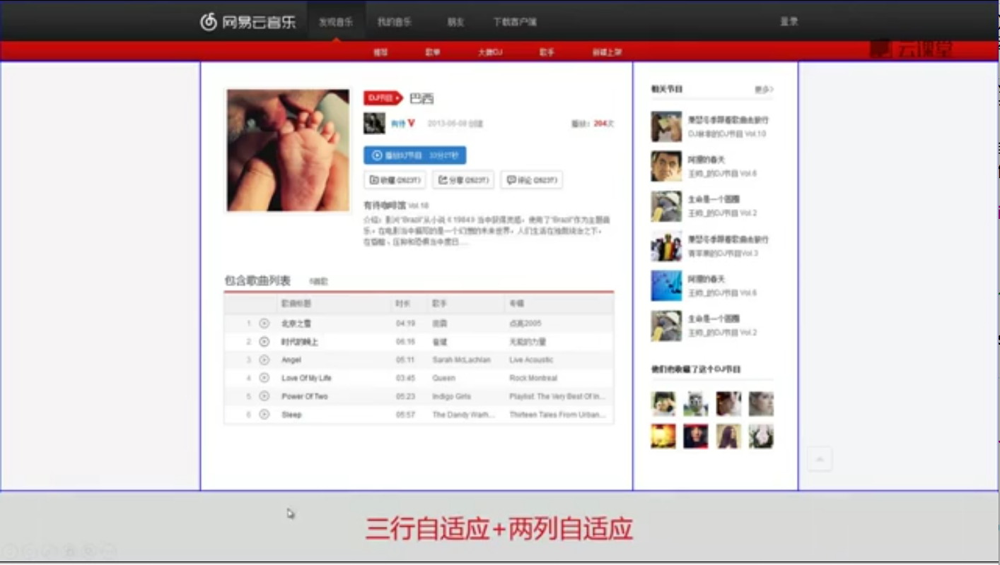

<!-- START doctoc generated TOC please keep comment here to allow auto update -->
<!-- DON'T EDIT THIS SECTION, INSTEAD RE-RUN doctoc TO UPDATE -->
**Table of Contents**  *generated with [DocToc](https://github.com/thlorenz/doctoc)*

- [常见布局样例](#%E5%B8%B8%E8%A7%81%E5%B8%83%E5%B1%80%E6%A0%B7%E4%BE%8B)
  - [display常见布局方式](#display%E5%B8%B8%E8%A7%81%E5%B8%83%E5%B1%80%E6%96%B9%E5%BC%8F)
    - [块级元素的水平居中](#%E5%9D%97%E7%BA%A7%E5%85%83%E7%B4%A0%E7%9A%84%E6%B0%B4%E5%B9%B3%E5%B1%85%E4%B8%AD)
    - [居中导航](#%E5%B1%85%E4%B8%AD%E5%AF%BC%E8%88%AA)
  - [position常见布局](#position%E5%B8%B8%E8%A7%81%E5%B8%83%E5%B1%80)
    - [固定顶栏布局](#%E5%9B%BA%E5%AE%9A%E9%A1%B6%E6%A0%8F%E5%B8%83%E5%B1%80)
    - [遮罩布局](#%E9%81%AE%E7%BD%A9%E5%B8%83%E5%B1%80)

<!-- END doctoc generated TOC please keep comment here to allow auto update -->

### 常见布局样例

#### display常见布局方式

##### 块级元素的水平居中



实现代码：

```html
<!DOCTYPE html>
<html>
<head>
	<meta charset="UTF-8">
	<title>居中导航</title>
	<style>
		/* 垂直方向零边距，水平方向auto，即水平居中 */
		.content{margin: 0 auto; width:500px; background-color: pink;};
	</style>
</head>
<body>
	<div>
	    <div class="content">content area</div>
	</div>
</body>
</html>
```

##### 居中导航



实现代码：

```html
<!DOCTYPE html>
<html>
<head>
	<meta charset="UTF-8">
	<title>居中导航</title>
	<style>
		/* 主要CSS */
		ul{text-align: center;height: 30px;line-height: 30px;background-color: #f00;}
		li, a{display: inline-block;width: 80px;height: 100%;}
		li{margin: 0 5px;list-style: none;}
		/* 其他效果 */
		a, a:hover, li.cur a{color: #fff;text-decoration: none;}
		a:hover, li.cur a{background-color: #c00}
	</style>
</head>
<body>
	<ul class="m-nav">
	  <li><a href="#">推荐</a></li>
	  <li class="cur"><a href="#">歌单</a></li>
	  <li><a href="#">大牌DJ</a></li>
	  <li><a href="#">歌手</a></li>
	  <li><a href="#">新碟上架</a></li>
	</ul> 
</body>
</html>
```

#### position常见布局

##### 固定顶栏布局



固定顶栏布局可以用绝对定位的方式实现，也可以用固定定位的方式实现：

绝对定位方式实现：

```html
<!DOCTYPE html>
<html>
<head>
	<meta charset="UTF-8">
	<title>固定顶栏，用absolute实现</title>
	<style>
		body{margin: 0;line-height: 1.8;}
		.top{background-color: pink;color: #fff;}
		.main{height: 3000px;background-color: #eee;}
		body{padding-top: 50px;}
		/* 关键代码 */
		.top{position: absolute;top: 0; left: 0;width: 100%;height: 50px;}
		.main{position: absolute; top: 50px; left: 0; width: 100%;}
	</style>
</head>
<body>
	<div class="top">top bar</div>
	<div class="main">main content area</div>
</body>
</html>
```
固定定位方式：

```html
<!DOCTYPE html>
<html>
<head>
	<meta charset="UTF-8">
	<title>固定顶栏</title>
	<style>
		body{margin: 0;line-height: 1.8;}
		.top{background-color: pink;color: #fff;}
		.main{height: 3000px;background-color: #eee;}
		/* 关键代码 */
		body{padding-top: 50px;}
		.top{position: fixed;top: 0;width: 100%;height: 50px;}
	</style>
</head>
<body>
	<div class="top">top bar</div>
	<div class="main">main content area</div>
</body>
</html>
```

##### 遮罩布局



实现代码：

```html

```html
<!DOCTYPE html>
<html>
<head>
	<meta charset="UTF-8">
	<title>遮罩</title>
	<style>
		.mask{position: fixed;top: 0;left: 0;z-index: 999;width: 100%;height: 100%;background-color: gray;opacity: 0.2;}
		.content{height: 3000px;}
	</style>
</head>
<body>
	<div id="mask" class="mask" style="display: none"></div>
	<div class="content"><input type="button" onclick="showMask()" value="开启遮罩"/></div>
	<script type="text/javascript">
		function showMask(){
			document.getElementById("mask").style.display = "block";
		}
	</script>
</body>
</html>
```

##### 三行自适应布局


绝对定位方式实现：

```html
<!DOCTYPE html>
<html>
<head>
	<meta charset="UTF-8">
	<title>三行自适应布局</title>
	<style>
		/* 关键代码 */
		.content{height: 2000px;}
		.foot{position: absolute;bottom: 0;left: 0;width: 100%;height: 100px;background-color: #ccc;}
		/* 其他 */
		.head{position: absolute;top: 0;left: 0;width: 100%;height: 100px;background-color: #ccc;}
		.body{position: absolute;top: 100px;left: 0;bottom: 100px;right: 0;overflow: auto;}
	</style>
</head>
<body>
	<div class="head">head</div>
	<div class="body">
	  <div class="content">content area</div>
	</div>
	<div class="foot">foot</div>
</body>
</html>
```

固定定位方式实现：

```html
<!DOCTYPE html>
<html>
<head>
	<meta charset="UTF-8">
	<title>三行自适应布局-fixed实现</title>
	<style>
		.head{position:fixed; top:0; left:0; width:100%; height:100px; background-color: #ccc;}
		.body{position:fixed; top:100px; left:0; bottom:100px; right:0; overflow: auto;}
		.content{height: 2000px;}
		.foot{position: fixed;bottom: 0;left: 0;width: 100%;height: 100px;background-color: #ccc;}
	</style>
</head>
<body>
	<div class="head">head</div>
	<div class="body">
	  <div class="content">content area</div>
	</div>
	<div class="foot">foot</div>
</body>
</html>
```

#### Float 常见布局

##### 两列布局（用float实现）


实现代码：

```html
<!DOCTYPE html>
<html>
<head>
	<meta charset="UTF-8">
	<title>两列布局</title>
	<style>
		html, body, .body, .main, .side{margin: 0;padding: 0;height: 100%;}
		.body{width: 960px; margin: 0 auto;}
		.main{background-color: pink;}
		.side{background-color: #eee;}
		/* 关键代码 */
		.main{float: left;width: 660px;}
		.side{float: right;width: 300px;}
		.clearfix:after{content:'.';display: block;clear: both;height: 0;overflow: hidden;visibility: hidden;}
	</style>
</head>
<body>
	<div class="body clearfix">
		<div class="main">main</div>
		<div class="side">side</div>
	</div>
</body>
</html>
```

#### Flex布局案例

##### 三行自适应+两列自适应



实现代码：

```html
<html>
<head>
	<meta charset="utf-8">
	<title>三行自适应+两列自适应</title>
	<style type="text/css">
		/* 设置背景色和全局属性*/
		html, body{margin: 0; text-align: center;}
		.head, .foot{line-height: 100%; background-color: #000; color: #fff;}
		.side{background-color: yellow;}
		.main{background-color: pink;}
		/* 设置自适应参数 */
		html, body{line-height: 100%;}
		body{display: flex; flex-flow: column;}
		.head, .foot{height: 100px;}
		.body{flex: 1; display: flex;}
		.side{width: 200px;}
		.main{flex: 1;}
		/*.main{margin-left: 10px;}*/
		/*.body{width: 500px; align-self: center;}*/
	</style>
</head>
<body>
	<div class="head">head</div>
	<div class="body">
		<div class="side">side</div>
		<div class="main">main</div>
	</div>
	<div class="foot">foot</div>
</body>
</html>
```
