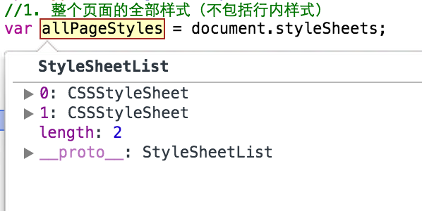
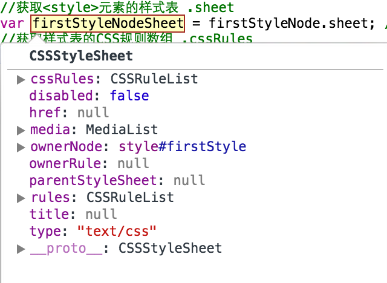
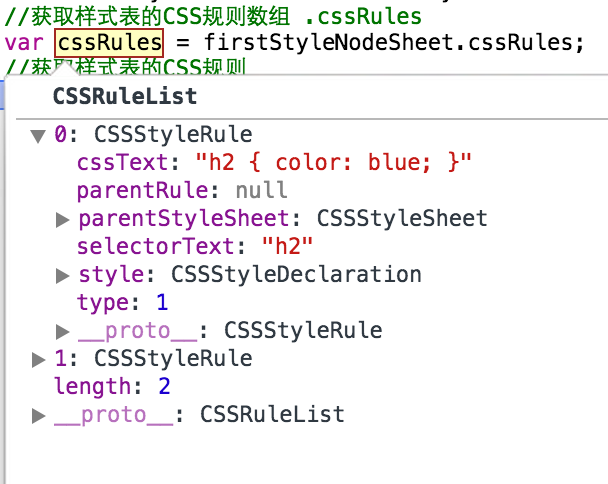
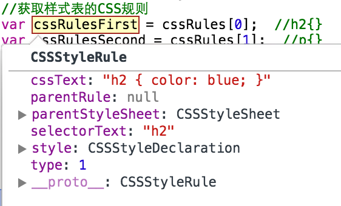
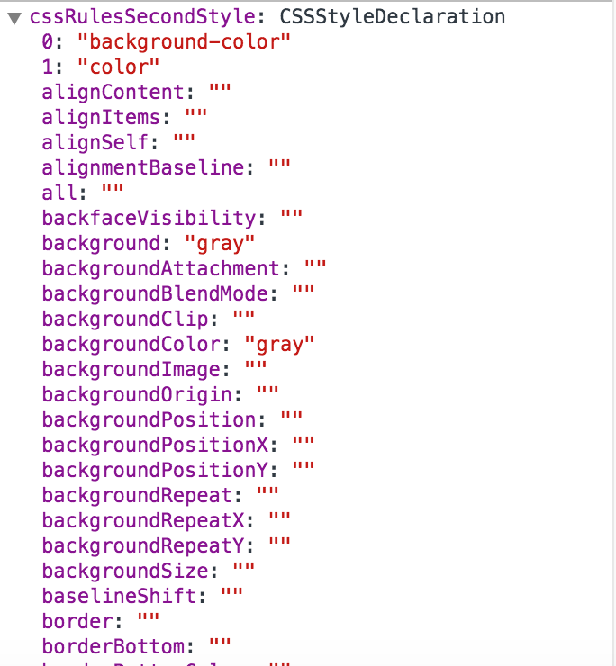

<!-- START doctoc generated TOC please keep comment here to allow auto update -->
<!-- DON'T EDIT THIS SECTION, INSTEAD RE-RUN doctoc TO UPDATE -->
**Table of Contents**  *generated with [DocToc](https://github.com/thlorenz/doctoc)*

  - [样式操作](#%E6%A0%B7%E5%BC%8F%E6%93%8D%E4%BD%9C)
    - [DOM 中的样式对象](#dom-%E4%B8%AD%E7%9A%84%E6%A0%B7%E5%BC%8F%E5%AF%B9%E8%B1%A1)
      - [`StyleSheetList` 样式表列表对象](#stylesheetlist-%E6%A0%B7%E5%BC%8F%E8%A1%A8%E5%88%97%E8%A1%A8%E5%AF%B9%E8%B1%A1)
      - [`CSSStyleSheet` 样式表对象](#cssstylesheet-%E6%A0%B7%E5%BC%8F%E8%A1%A8%E5%AF%B9%E8%B1%A1)
      - [`cssRuleList` CSS规则列表对象](#cssrulelist-css%E8%A7%84%E5%88%99%E5%88%97%E8%A1%A8%E5%AF%B9%E8%B1%A1)
      - [`CSSStyleRule` CSS规则对象](#cssstylerule-css%E8%A7%84%E5%88%99%E5%AF%B9%E8%B1%A1)
      - [`CSSStyleDeclaration`  CSS样式声明对象](#cssstyledeclaration--css%E6%A0%B7%E5%BC%8F%E5%A3%B0%E6%98%8E%E5%AF%B9%E8%B1%A1)
    - [获取样式](#%E8%8E%B7%E5%8F%96%E6%A0%B7%E5%BC%8F)
- [红色的字](#%E7%BA%A2%E8%89%B2%E7%9A%84%E5%AD%97)
  - [蓝色的字](#%E8%93%9D%E8%89%B2%E7%9A%84%E5%AD%97)
    - [灰色的字](#%E7%81%B0%E8%89%B2%E7%9A%84%E5%AD%97)
- [Hello, World!](#hello-world)
    - [修改样式](#%E4%BF%AE%E6%94%B9%E6%A0%B7%E5%BC%8F)
      - [通过 node.style 修改](#%E9%80%9A%E8%BF%87-nodestyle-%E4%BF%AE%E6%94%B9)
- [红色的字](#%E7%BA%A2%E8%89%B2%E7%9A%84%E5%AD%97-1)
  - [蓝色的字](#%E8%93%9D%E8%89%B2%E7%9A%84%E5%AD%97-1)
    - [灰色的字](#%E7%81%B0%E8%89%B2%E7%9A%84%E5%AD%97-1)
- [红色的字](#%E7%BA%A2%E8%89%B2%E7%9A%84%E5%AD%97-2)
- [红色的字](#%E7%BA%A2%E8%89%B2%E7%9A%84%E5%AD%97-3)
      - [node.style.cssText 修改](#nodestylecsstext-%E4%BF%AE%E6%94%B9)
  - [蓝色的字](#%E8%93%9D%E8%89%B2%E7%9A%84%E5%AD%97-2)
    - [灰色的字](#%E7%81%B0%E8%89%B2%E7%9A%84%E5%AD%97-2)
- [红色的字](#%E7%BA%A2%E8%89%B2%E7%9A%84%E5%AD%97-4)
- [红色的字](#%E7%BA%A2%E8%89%B2%E7%9A%84%E5%AD%97-5)
      - [通过更新 class 修改（推荐）](#%E9%80%9A%E8%BF%87%E6%9B%B4%E6%96%B0-class-%E4%BF%AE%E6%94%B9%EF%BC%88%E6%8E%A8%E8%8D%90%EF%BC%89)
  - [蓝色的字](#%E8%93%9D%E8%89%B2%E7%9A%84%E5%AD%97-3)
    - [灰色的字](#%E7%81%B0%E8%89%B2%E7%9A%84%E5%AD%97-3)
- [红色的字](#%E7%BA%A2%E8%89%B2%E7%9A%84%E5%AD%97-6)
    - [统一更新多个元素样式](#%E7%BB%9F%E4%B8%80%E6%9B%B4%E6%96%B0%E5%A4%9A%E4%B8%AA%E5%85%83%E7%B4%A0%E6%A0%B7%E5%BC%8F)

<!-- END doctoc generated TOC please keep comment here to allow auto update -->

## 样式操作

通过 JavaScript 动态修改页面样式。

### DOM 中的样式对象


#### `StyleSheetList` 样式表列表对象

`var styleSheetList = document.styleSheets;`	 

由StyleSheet样式表对象组成



#### `CSSStyleSheet` 样式表对象

`var firstStyleNodeSheet = firstStyleNode.sheet;`

样式表对象，包含了cssRules列表对象

<!---->

#### `cssRuleList` CSS规则列表对象

`var cssRules = firstStyleNodeSheet.cssRules;`	

CSS规则列表对象，包含了所有的CSS规则



#### `CSSStyleRule` CSS规则对象

`var cssRulesFirst = cssRules[0]`



#### `CSSStyleDeclaration`  CSS样式声明对象

`var styleDeclaration = cssRules[0].style;`	

对应一个个`key-value`的键值对



### 获取样式

```html
<html>
<head>
	<meta charset="utf-8">
	<title>Test</title>
	<link rel="stylesheet" type="text/css" href="sample.css">
	<style id="firstStyle" type="text/css">
		h2{color: blue;}
		p{background-color: gray; color: white;}
	</style>
</head>
<body>
	<h1>红色的字</h1>
	<h2>蓝色的字</h2>
	<h3 id="h3" style="color: gray">灰色的字</h3>
	<script type="text/javascript">
		//1. 整个页面的全部样式（不包括行内样式）
		var allPageStyles = document.styleSheets;

		/* 2.内联样式表 styleNode.sheet.cssRules[0].style */
		var firstStyleNode = document.getElementById("firstStyle");
		//获取<style>元素的样式表 .sheet
		var firstStyleNodeSheet = firstStyleNode.sheet;	//h2{} p{}
		//获取样式表的CSS规则数组 .cssRules
		var cssRules = firstStyleNodeSheet.cssRules;
		//获取样式表的CSS规则  
		var cssRulesFirst = cssRules[0];  //h2{}
		var cssRulesSecond = cssRules[1];  //p{}
		//获取CSS规则的名称   cssRule.selectorText
		var cssRulesFirstName = cssRulesFirst.selectorText;	//h2
		var cssRulesSecondName = cssRulesSecond.selectorText; //p
		//获取CSS规则的具体内容 .style
		var cssRulesFirstStyle = cssRulesFirst.style;  //color: blue;
		var cssRulesSecondStyle = cssRulesSecond.style;	//background-color: gray; color: white;
		//获取具体属性值
		var h2Color = cssRulesFirstStyle.color;	//blue
		var pColor = cssRulesSecondStyle.color;	//white
		alert("Make a breakpoint here to see the value");

		//3.内部样式表 node.style
		var h3Node = document.getElementById("h3");
		var h3Style = h3Node.style;
		var h3Color = h3Style.color;	//gray
		alert("Make a breakpoint here to see the value");
	</script>
</body>
</html>
```

NOTE：上面用`h3Node.style`获取h3节点的样式，只能获取到h3元素在行内样式设置的值。而无法获取到用户实际设置的属性值。如果要获取到用户的实际属性值，那么可以用下面的window.getComputedStyle()

**window.getComputedStyle()**

`var nodeStyle = window.getComputedStyle(node)`

将需要取出样式的目标元素传入 `window.getComputedStyle()` 函数中，即可得到对应元素的实际样式。

```html
<html>
<head>
	<meta charset="utf-8">
	<title>Test</title>
	<style type="text/css">
		h1{color: red;}
	</style>
</head>
<body>
	<h1>Hello, World!</h1>
	<script type="text/javascript">
		var h1Node = document.querySelector("h1");
		/* 1. 获取的只是行内样式设置的值 */
		var h1Color = h1Node.style.color;	//""  （空值）
		/* 2. 用 window.getComputedStyle() 获取实际值 */
		var realH1Color = window.getComputedStyle(h1Node).color;  //"rgb(255, 0, 0)" （红色）
		alert("Make Breakpoint!");
	</script>
</body>
</html>
```

NOTE：注意的是这里获取到的样式值为**只读**属性不可修改！

NOTE：此方法不支持 IE9 以下版本，IE9 中需使用 `node.currentStyle` 来做兼容。


### 修改样式

#### 通过 node.style 修改

```html
<html>
<head>
	<meta charset="utf-8">
	<title>Test</title>
	<link rel="stylesheet" type="text/css" href="sample.css">
	<style id="firstStyle" type="text/css">
		h2{color: blue;}
		p{background-color: gray; color: white;}
	</style>
</head>
<body>
	<h1>红色的字</h1>
	<h2>蓝色的字</h2>
	<h3 id="h3" style="color: gray">灰色的字</h3>
	<script type="text/javascript">
		var h1Node = document.querySelector("h1");
		/* 修改样式 */
		h1Node.style.color = "blue";
		/* 增加样式 */
		h1Node.style.background = "gray";
	</script>
</body>
</html>
```

增加样式后得到的结果：

`<h1 style="color: blue; background: gray;">红色的字</h1>`

**缺点**

- 每个属性的更新都需要一个命令
- 其赋值的方式不是我们所熟悉的方式
- 命名异常（不为常规 CSS 命运）

#### node.style.cssText 修改

一次同时设置多个行间样式，其结果同 `node.style` 单独设置相同。

```html
<html>
<head>
	<meta charset="utf-8">
	<title>Test</title>
	<style id="firstStyle" type="text/css">
		h1{color: red;}
		h2{color: blue;}
		p{background-color: gray; color: white;}
	</style>
</head>
<body>
	<h1>红色的字</h1>
	<h2>蓝色的字</h2>
	<h3 id="h3" style="color: gray">灰色的字</h3>
	<script type="text/javascript">
		var h1Node = document.querySelector("h1");
		/* 修改样式 */
		h1Node.style.cssText += "background: gray;"
	</script>
</body>
</html>
```

增加样式后得到的结果

`<h1 style="color: red; background: gray;">红色的字</h1>`

**以上两种方式均将样式混合在逻辑当中**，并不是很好的应用方式。

#### 通过更新 class 修改（推荐）

```html
<html>
<head>
	<meta charset="utf-8">
	<title>Test</title>
	<style id="firstStyle" type="text/css">
		h1{color: red;}
		h2{color: blue;}
		p{background-color: gray; color: white;}
		.grayBg{background-color: gray;}
	</style>
</head>
<body>
	<h1>红色的字</h1>
	<h2>蓝色的字</h2>
	<h3 id="h3" style="color: gray">灰色的字</h3>
	<script type="text/javascript">
		var h1Node = document.querySelector("h1");
		/* 通过class修改样式 */
		h1Node.className += "grayBg";
	</script>
</body>
</html>
```

增加样式后得到的结果：

`<h1 class="grayBg">红色的字</h1>`

### 统一更新多个元素样式

以上方法均布适合同时更新多个样式，通过更好样式表的方式则可同时更改多个页面中的样式。将需要的大量样式也在一个**皮肤样式**表中，通过 JavaScript 来直接更换样式表来进行样式改变。（此方法也可用于批量删除样式）

```html
<html>
<head>
	<meta charset="utf-8">
	<title>Test</title>
	<link id="springLink" rel="stylesheet" type="text/css" href="spring.css">
</head>
<body>
	<script type="text/javascript">
		var linkNode = document.getElementById("springLink");
		/* 修改为夏天皮肤的样式 */
		linkNode.setAttribute("href", "summer.css");
	</script>
</body>
</html>
```