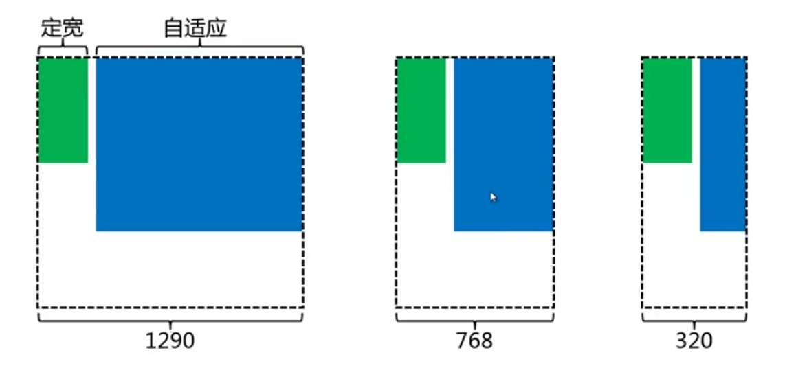
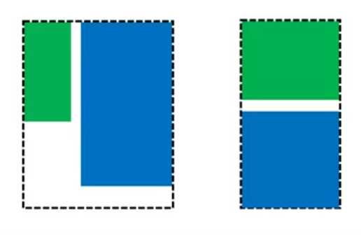

<!-- START doctoc generated TOC please keep comment here to allow auto update -->
<!-- DON'T EDIT THIS SECTION, INSTEAD RE-RUN doctoc TO UPDATE -->
**Table of Contents**  *generated with [DocToc](https://github.com/thlorenz/doctoc)*

- [响应式](#%E5%93%8D%E5%BA%94%E5%BC%8F)
  - [设置viewport](#%E8%AE%BE%E7%BD%AEviewport)
  - [@media](#@media)

<!-- END doctoc generated TOC please keep comment here to allow auto update -->

##响应式

**响应式优点**

- 无须为PC端和手机端各自开发一个网站

**响应式缺点**

- 相对于PC来说没有那么多的显示内容，但其实所有资源都加载了

### 设置viewport

通过设置viewport可以避免在屏幕变小的时候页面被自动缩放。   

设置viewport需要在head标签中设置如下信息：

`<meta name="viewport" content="width=device-width, initial-scale=1.0, user-scalable=no"/>`

- width=device-widt 设置视窗宽度为设备宽度
- initial-scale=1.0 设置初始缩放为1.0（即不缩放）
- user-scalable=no  禁止手动缩放

**少用定宽，多用自适应**

为了实现响应式，应该少用定宽的布局，而多用自适应。



### @media

通过`@media`设置条件，使得在不同的设备上执行不同的CSS代码。

```
@media screen and (max-width:320px){
	/* 视窗宽度 <= 320px */
}
```

```
@media screen and (min-width:769px)}
	/* 视窗宽度 >= 769px */
}
```

```
@media screen and (min-width:769px) and (max-width:1000px)}
	/* 769px <= 视窗宽度 <= 1000px */
}
```

**例子**



```
<div class="parent">
	<div class="left">
		<p>left</p>
	</div>
	<div class="right">
		<p>right</p>
		<p>right</p>
	</div>
</div>
<style>
.left{
	float: left;
	width: 100px;
	margin-right: 20px;
}
.right{
	overflow: hidden;
}
@media screen and (max-width: 320px){
	.left{
		float: none;
		width: auto;
		margin-right: 0;
		margin-bottom: 20px;
	}
}
</style>
```

NOTE：上面只是通过演示修改了一些宽度等布局方式，你可以通过@media方式去隐藏一些不想要显示的东西。


