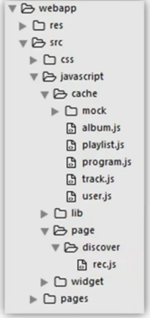
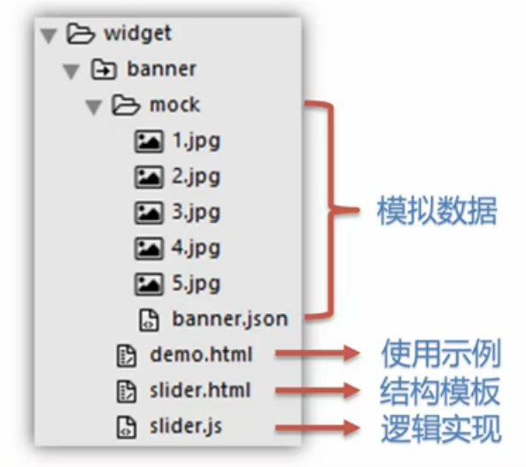
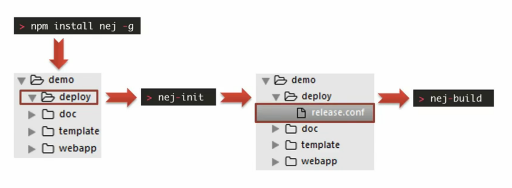
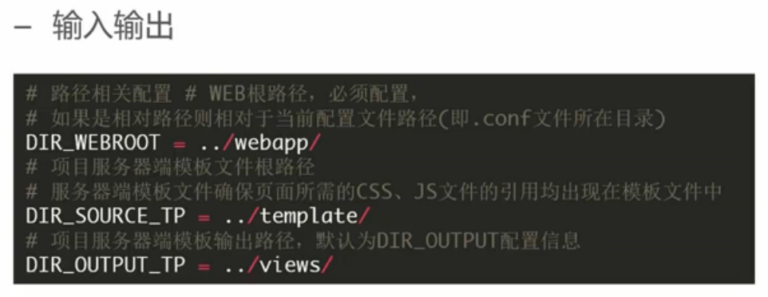
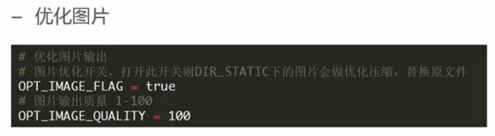
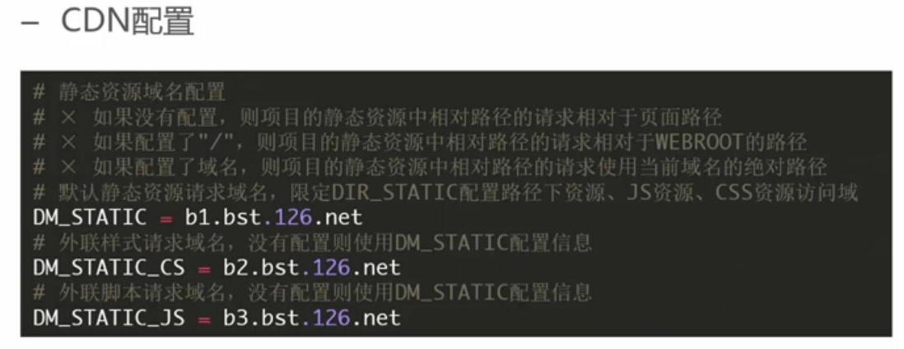
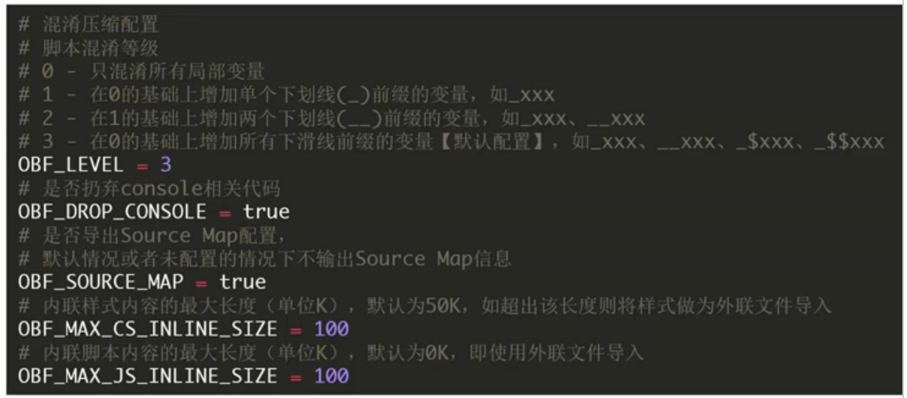
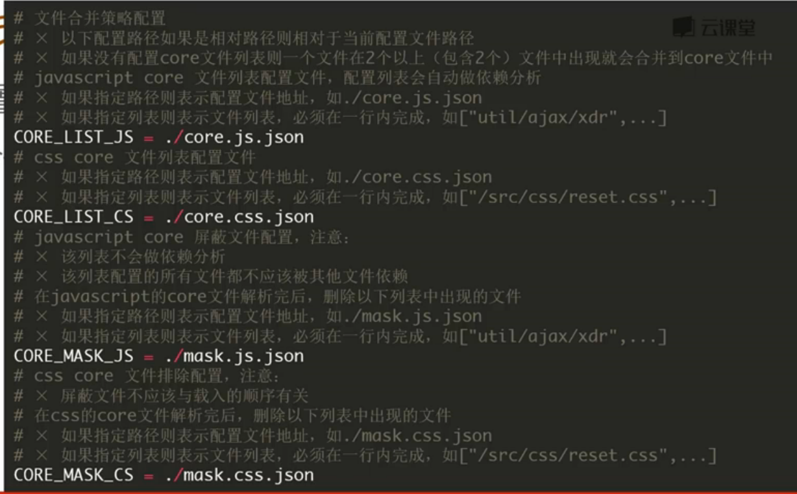

<!-- START doctoc generated TOC please keep comment here to allow auto update -->
<!-- DON'T EDIT THIS SECTION, INSTEAD RE-RUN doctoc TO UPDATE -->
**Table of Contents**  *generated with [DocToc](https://github.com/thlorenz/doctoc)*

- [开发实践](#%E5%BC%80%E5%8F%91%E5%AE%9E%E8%B7%B5)
  - [系统设计](#%E7%B3%BB%E7%BB%9F%E8%AE%BE%E8%AE%A1)
    - [交互说明](#%E4%BA%A4%E4%BA%92%E8%AF%B4%E6%98%8E)
    - [系统分解](#%E7%B3%BB%E7%BB%9F%E5%88%86%E8%A7%A3)
    - [接口设计](#%E6%8E%A5%E5%8F%A3%E8%AE%BE%E8%AE%A1)
    - [工程构建](#%E5%B7%A5%E7%A8%8B%E6%9E%84%E5%BB%BA)
  - [系统实现](#%E7%B3%BB%E7%BB%9F%E5%AE%9E%E7%8E%B0)
    - [视觉说明](#%E8%A7%86%E8%A7%89%E8%AF%B4%E6%98%8E)
    - [组件提取](#%E7%BB%84%E4%BB%B6%E6%8F%90%E5%8F%96)
    - [页面制作](#%E9%A1%B5%E9%9D%A2%E5%88%B6%E4%BD%9C)
    - [组件封装](#%E7%BB%84%E4%BB%B6%E5%B0%81%E8%A3%85)
    - [逻辑实现](#%E9%80%BB%E8%BE%91%E5%AE%9E%E7%8E%B0)
  - [测试发布](#%E6%B5%8B%E8%AF%95%E5%8F%91%E5%B8%83)
    - [本地测试](#%E6%9C%AC%E5%9C%B0%E6%B5%8B%E8%AF%95)
    - [对接联调](#%E5%AF%B9%E6%8E%A5%E8%81%94%E8%B0%83)
    - [发布上线](#%E5%8F%91%E5%B8%83%E4%B8%8A%E7%BA%BF)

<!-- END doctoc generated TOC please keep comment here to allow auto update -->

## 开发实践

### 系统设计

#### 交互说明

是系统的交互的说明

#### 系统分解

根据交互说明对系统进行系统模块分解。网易云音乐的分解可以简单分解成以下几个部分：

- 注册登录密码
- 系统主框架
	- 顶栏
	- 边栏
	- 底栏
	- 内容区

#### 接口设计

- 发现音乐 - 推荐
	- 推荐的Banner列表（同步）
	- 推荐的歌单列表（同步）
	- 推荐的榜单列表（同步）
	- 推荐的节目列表（异步）
	- 推荐的新碟列表（异步）

设计接口模块的接口规范，如`发现音乐-推荐`模块的规范：

- 数据类型
- 模板资源
- 异步接口
- 页面摘要（对这个模块规范的简要描述，包括了上面3项内容）

#### 工程构建

- 项目结构
	- 后端模板
	
	- 前端实现
	
- 初始代码
- 生成模拟数据

### 系统实现

#### 视觉说明

所有页面的视觉设计

#### 组件提取

对所有视觉稿进行提取，提取出通用的组件。常用可以提取的组件有以下几类：

- 通用元件（如：图标、歌单、专辑、按钮）
- 通用列表（如：音乐列表、榜单列表）
- 复合组件（如：评论组件等）
- 浮层弹窗（如：收藏歌单弹窗等）

#### 页面制作

对视觉稿进行html静态实现

- 发现音乐-推荐
	-  Banner
	- 推荐歌单
	- 大牌DJ
	- 最新专辑
	- 最新专曲
	
#### 组件封装

- BannerSlider Banner幻灯片组件

NOTE：使用NEJ框架

#### 逻辑实现

- 数据层的实现
- 页面模板实现（rec.ftl）
- 控制层实现

### 测试发布

#### 本地测试

- 配置模拟数据
	- 使用同步模拟数据
	- 使用异步模拟数据
	
#### 对接联调

- 去除同步模拟数据
- 去除异步模拟数据

#### 发布上线

- 打包发布

选用nej构建工具以及npm模块管理工具

	

- 打包配置

- 优化图片

- CDN配置

- 代码压缩

- 代码合并

