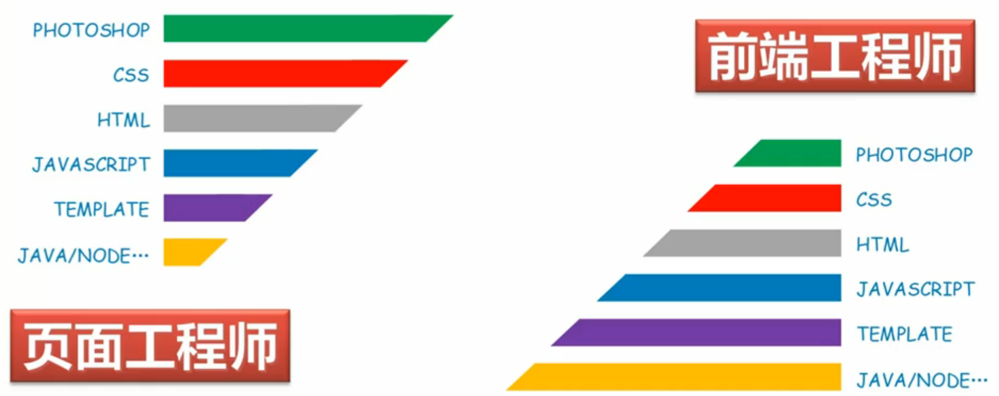
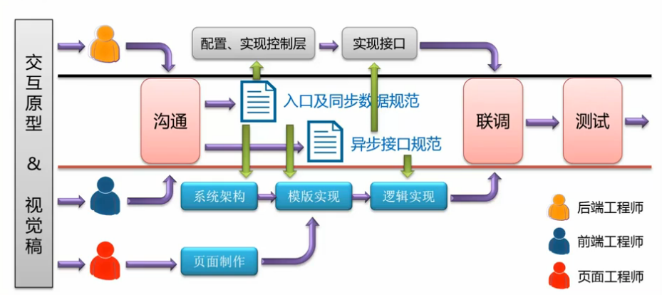
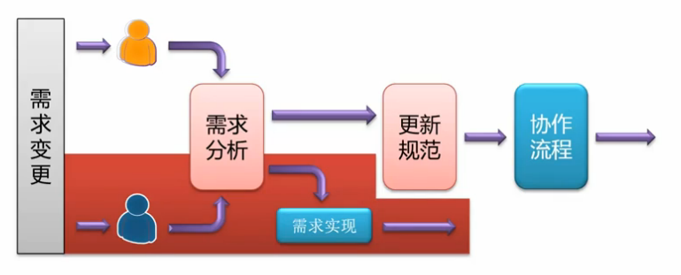

<!-- START doctoc generated TOC please keep comment here to allow auto update -->
<!-- DON'T EDIT THIS SECTION, INSTEAD RE-RUN doctoc TO UPDATE -->
**Table of Contents**  *generated with [DocToc](https://github.com/thlorenz/doctoc)*

- [协作流程](#%E5%8D%8F%E4%BD%9C%E6%B5%81%E7%A8%8B)
  - [Web 系统](#web-%E7%B3%BB%E7%BB%9F)
    - [技术栈全览](#%E6%8A%80%E6%9C%AF%E6%A0%88%E5%85%A8%E8%A7%88)
  - [角色定义](#%E8%A7%92%E8%89%B2%E5%AE%9A%E4%B9%89)
    - [前端工程师](#%E5%89%8D%E7%AB%AF%E5%B7%A5%E7%A8%8B%E5%B8%88)
      - [项目工时分配比](#%E9%A1%B9%E7%9B%AE%E5%B7%A5%E6%97%B6%E5%88%86%E9%85%8D%E6%AF%94)
  - [协作流程](#%E5%8D%8F%E4%BD%9C%E6%B5%81%E7%A8%8B-1)
    - [开发过程](#%E5%BC%80%E5%8F%91%E8%BF%87%E7%A8%8B)
    - [维护过程](#%E7%BB%B4%E6%8A%A4%E8%BF%87%E7%A8%8B)
  - [职责说明](#%E8%81%8C%E8%B4%A3%E8%AF%B4%E6%98%8E)

<!-- END doctoc generated TOC please keep comment here to allow auto update -->

## 协作流程

### Web 系统

Web 系统部署在服务器上为提出不同需求的外部客户端服务。

**MVC** (Model, View, Controller) 它们分别代表**数据层**，**视图层**，
和**控制层**。

- 数据层，封装数据管理操作（例如数据的 CRUD ）
- 视图层，展示数据模型提供人机交互
- 控制层，处理用户请求，委托数据层，选择视图层进行展示

NOTE：CRUD 代表 Create、Read、Update、Delete。

下面以用户请求页面为例：

1. 客户端发送请求，服务器**控制层**接受到请求
1. 请求**数据层**获取数据，返回**控制层**
1. **控制层**根据数据选择合适的**视图层**进行展示
1. **视图层**生成页面代码，返回**控制层**
1. **控制层**返回客户端进行展示

#### 技术栈全览

- Photoshop，获取图片资源
- CSS 与 HTML，制作页面
- JavaScript 前端交互逻辑
- Template 结构与内容分离整合
- Java/PHP/Node 后端逻辑

**弊端**

- 后期维护性差（相同内容，不同形成存在）
- 专业化程度低
- 需求响应速度慢

**前端工程师新责任**

随着视图层也会存在业务逻辑的需求，前端工程师也会参与到业务逻辑的实现中去。
这样使前端工程师可以在后期转换成**全栈工程师**（Fullstack Developer)。

### 角色定义

完成一个 Web 系统需要至少以下三种角色：

- 视觉工程师，视觉稿到交互原型的转化
- 前端工程师，实现系统前端交互逻辑
- 后端工程师，系统后端业务逻辑

#### 前端工程师

前端部分又可再细分为**页面工程师**和前端工程师**。前者更注重和视觉工程师的协作，
后者则更多的与后端工程师进行协作。

**页面工程师**

- 精通切图技术 （Photoshop，Sketch）
- 精通页面制作 （CSS，HTML）
- 熟悉前端开发技术 （JavaScript，Template）
- 了解后端开发技术 （Java，Node）

**前端工程师**

- 精通页面制作 （CSS，HTML）
- 精通前端开发技术 （JavaScript，Template）
- 熟悉切图技术 （Photoshop，Sketch）
- 熟悉后端开发技术 （Java，Node）

##### 项目工时分配比

- 页面制作：3天
- 前端逻辑：7天
- 后端逻辑：10天

NOTE：多角色开发会比单人工程增加工作沟通成本。

### 协作流程

#### 开发过程

按照流程规范可以明确角色和其对应的职责，这样可以大大减少角色间的沟通成本。

[Document]

- 页面入口规范，定义系统对外可访问入口以及入口的配置信息
- 同步数据规范，定义系统对模板文件的预填信息
- 异步接口规范，定义前后端异步数据交互的接口信息

#### 维护过程

NOTE：红色路径为不需要改变规范的前提下，响应需求变更。

### 职责说明

下面将总结各个角色职责具体任务：

**页面工程师**

- 切图、图片优化
- 页面制作、优化页面效果与结构（适合业务逻辑开发）
- 完成简单的前端业务逻辑开发

**前端工程师**

- 主导制定前后端分离规范
- 主导前端联调对接测试
- 系统前端设计架构、满足一定的非功能性需求（如性能、可拓展性等）
- 完成系统前端的业务逻辑实现、优化实现逻辑

**后端工程师**

- 协助定制前后端分离规范
- 协作前后端联调对接测试
- 完成后端系统框架及业务逻辑实现

角色与人之间不一定需要一一对应，前端工程师和页面工程师可能是一人。
全栈工程师则有能力包揽一切。
