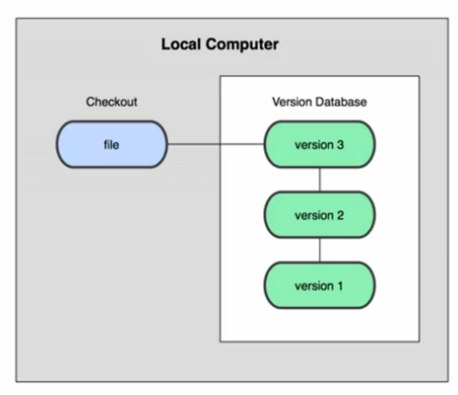
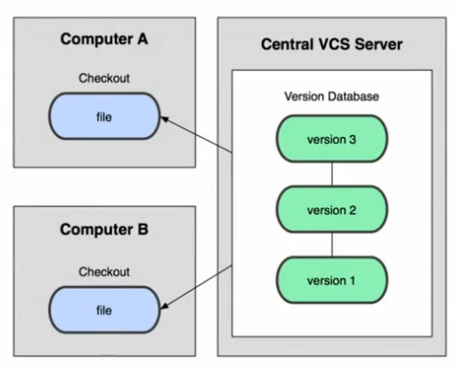
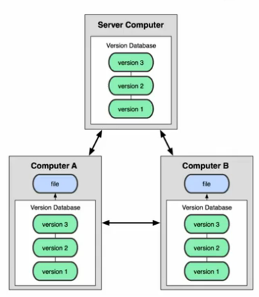
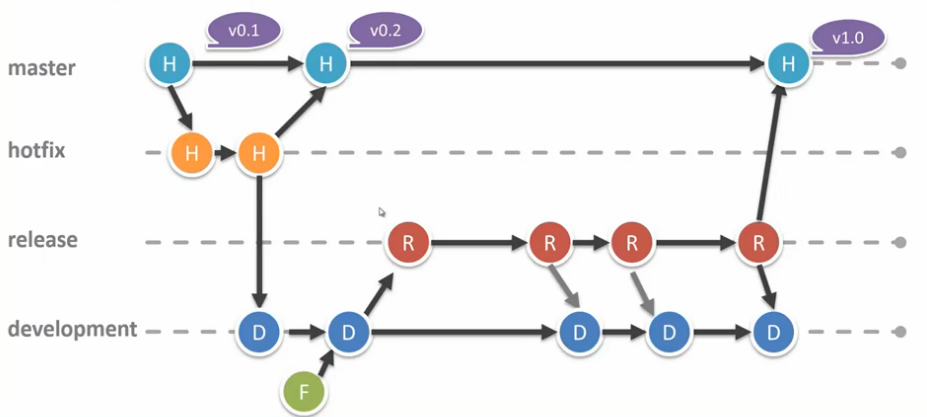
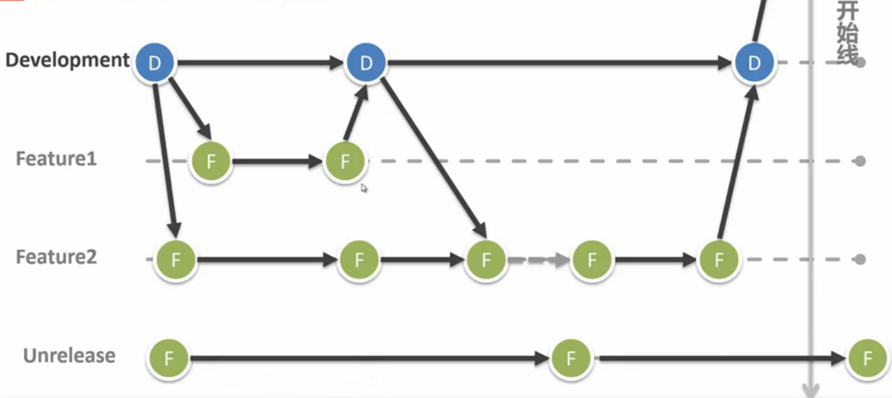
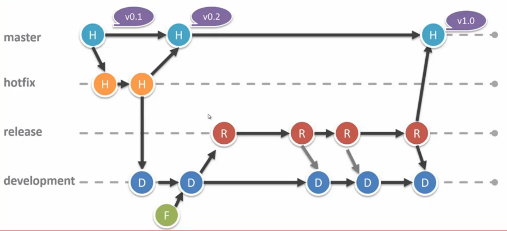
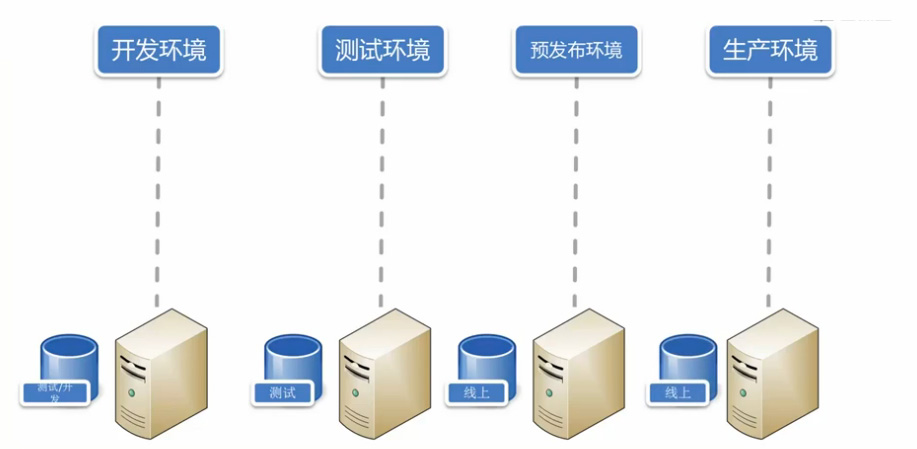

<!-- START doctoc generated TOC please keep comment here to allow auto update -->
<!-- DON'T EDIT THIS SECTION, INSTEAD RE-RUN doctoc TO UPDATE -->
**Table of Contents**  *generated with [DocToc](https://github.com/thlorenz/doctoc)*

- [版本控制](#%E7%89%88%E6%9C%AC%E6%8E%A7%E5%88%B6)
  - [版本控制系统](#%E7%89%88%E6%9C%AC%E6%8E%A7%E5%88%B6%E7%B3%BB%E7%BB%9F)
  - [分支模型](#%E5%88%86%E6%94%AF%E6%A8%A1%E5%9E%8B)
    - [产品级开发分支模型](#%E4%BA%A7%E5%93%81%E7%BA%A7%E5%BC%80%E5%8F%91%E5%88%86%E6%94%AF%E6%A8%A1%E5%9E%8B)
    - [常见的两个分支模型](#%E5%B8%B8%E8%A7%81%E7%9A%84%E4%B8%A4%E4%B8%AA%E5%88%86%E6%94%AF%E6%A8%A1%E5%9E%8B)
    - [环境](#%E7%8E%AF%E5%A2%83)
  - [Git](#git)

<!-- END doctoc generated TOC please keep comment here to allow auto update -->

## 版本控制

版本管理涉及团队协作，产品质量，和产品上线。使用版本控制工具可使我们自由的做的一些几点：

- 回退到任意版本
- 查看历史版本
- 对比两个版本差异

### 版本控制系统

版本控制系统（Version Control System）是一种记录若干文件修订记录的系统，它可以帮助开发者查阅或回档至某个历史版本。

- 手动版本控制
- LVCS 本地
- CVCS 集中式（例如 SVN）
- DVCS 分布式（例如 Git）

**手动版本控制**

无法有效找到需要版本和差异，污染工作目录结构。

**Local VCS 本地式**

于是出现了本地版本控制系统 RCS（Reversion Control System），其利用本地版本数据库存储不断出现的文件版本。
它可以迅速找出需求的版本和维持工作目录结构。其缺点是不支持协同开发，这也让开发者不将其选做通用的版本控制工具来使用。

**CVCS 集中式**

利用中央服务器来管理文件版本，但每一次操作都需要网络请求，且具有致命的单点故障。
（既中央服务器故障可导致，无法协同工作或数据丢失）

**DVCS 分布式**

分布式指的是每一份本地仓库都是一个完整的项目历史拷贝，即使一份仓库丢失或者损坏也可以从其他的仓库中获取此项目的完整历史记录。
也因为在添加新版本不需要网络，这可以使操作流程。

### 分支模型

如果多人并行在一条线上开发会导致开发困难并且难以定位错误位置。

分支，就是从目标仓库获得一份项目拷贝，每条分支都具有和原仓库功能一样的开发线。

分支模型（Branching Model）或称之为工作流（Workflow），它是一个围绕项目
**开发**、**部署**、**测试**等工作流的分支操作（创建及合并等）的规范集合。

#### 产品级开发分支模型

**常驻分支**

- development，从 master 创建，是开发分支
- production（master），默认分支可用于发布的代码，是产品分支，即master分支

**活动分支**

- feature，从 development创建，其为特性分支
- hotfix，从 master 创建，用于修复 Bug
- release，从 development 创建，标识一个产品的正式发布

#### 常见的两个分支模型

**分支模型——特性开发**

**分支模型——发布线**

#### 环境

- 开发环境，使用测试开发配置（数据库，缓存，元数据配置）
  - 使用提交到下一个 release 的特性分支
- 测试环境，使用测试配置（测试数据库）
  - 使用 release/development
- 预发布环境，小范围发布使用线上数据库模拟真实环境
  - 使用 release
- 生产环境，线上配置
  - 使用 master
  
### Git

Git 是一个免费开源的分布式版本控制系统，它也一个基于内容寻址的存储系统。
Git 是由 Linux 的创造者 Linus Torvalds。

**优势**

- 速度快，不依赖网络
- 完全分布式
- 轻量级分支操作
- Git 为行业标准版本控制工具
- 活跃和成熟的社区

**安装**

**Mac OS X** 下使用 `brew install git` 下载更新既可。

**Linux Ubuntu** 下可使用 `apt-get install git` 既可。

**Windows** 下使用`msysgit`软件