<!-- START doctoc generated TOC please keep comment here to allow auto update -->
<!-- DON'T EDIT THIS SECTION, INSTEAD RE-RUN doctoc TO UPDATE -->
**Table of Contents**  *generated with [DocToc](https://github.com/thlorenz/doctoc)*

- [框架选型](#%E6%A1%86%E6%9E%B6%E9%80%89%E5%9E%8B)
  - [框架选项的解决方案](#%E6%A1%86%E6%9E%B6%E9%80%89%E9%A1%B9%E7%9A%84%E8%A7%A3%E5%86%B3%E6%96%B9%E6%A1%88)
    - [DOM 解决方案](#dom-%E8%A7%A3%E5%86%B3%E6%96%B9%E6%A1%88)
    - [Communication 解决方案](#communication-%E8%A7%A3%E5%86%B3%E6%96%B9%E6%A1%88)
    - [Utility （Lang）](#utility-%EF%BC%88lang%EF%BC%89)
    - [Templating 模板](#templating-%E6%A8%A1%E6%9D%BF)
    - [Component 组件](#component-%E7%BB%84%E4%BB%B6)
    - [Routing 路由](#routing-%E8%B7%AF%E7%94%B1)
    - [Architecture 解耦](#architecture-%E8%A7%A3%E8%80%A6)

<!-- END doctoc generated TOC please keep comment here to allow auto update -->

## 框架选型

只局限于JS的框架选型

**理解库和框架的区别**

**库**

- 针对特定问题的解答
- 不控制应用程序
- 被动地被调用

**框架**

- 控制反转（与库最大的区别）
- 决定应用程序声明周期
- 一般会集成大量的库

**为什么使用外部的框架**

- 开发效率高
- 可靠性高（浏览器兼容/测试覆盖）
- 更好地配套（文档/DEMO/工具）
- 设计的更好
- 专业性

**什么时候不选择外部框架**

- 问题过于简单
- 备选框架质量与可控性无法保证
- 无法满足当前业务需求
- 团队中已有相关积累

### 框架选项的解决方案

1. DOM
2. Communication（通信）
3. Utility
4. Templating
5. Component
6. Routing
7. Architecture

**XXX**

- 开放：基于一个外部模块系统，自由组合
- 半开放：基于一个定制过的模块系统，每部-外部的解决方案共存
- 大教堂：深度定制的模块系统，很少需要引入外部模块

#### DOM 解决方案

Selector / Manipulation(DOM操作) / Event(事件处理) / Animation

**DOM操作职责**

- 提供便利的DOM查询/操作/移动等操作
- 提供事件绑定/事件代理等支持
- 提供浏览器特性检测、UA侦测
- 提供节点属性、样式、类型等操作
- 所有以上操作实现目标平台的跨浏览器支持

**jQuery 技术方案** 

获取到的对象是一个包装过的DOM对象

**zepto.js 技术方案**

轻量级方案，比jQuery轻量，常用语移动端产品的开发

**mootools 技术方案**

源码实现非常好，严格遵循Command-Query规范。其最大的特点是用选择器获取到的对象是原生DOM对象（因为Mootools直接拓展了Dom对象的方法）。

**对比**

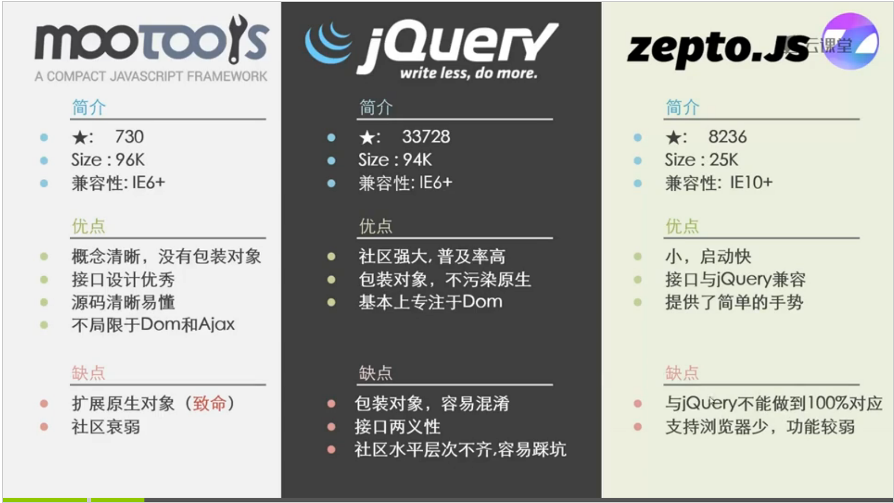

jQuery：最稳妥的方案

Mootools：最好的源码阅读学习资源

zepto.js：移动端的备选品

**其他专业领域的DOM选择方案**

**手势库**

- Hammer.js
- size: 12K
- Issue：444/600
- Desc:常见手势封装，包括tap、hold、transform、swipe等，并支持自定义拓展

**局部滚动**

- iscroll.js
- size：13K
- Issue：380/640
- Desc：移动端position：fix + overflow:scroll的救星

**高级动画**

- Velocity.js
- Size：12K
- Issue：400/411
- Desc：复杂动画序列实现，不仅限于DOM

**视频播放**

- video.js
- Size：101K
- Issue：1160/1290
- Desc：类似原生video标签的使用方式，对低级浏览器回退到flash播放

NOTE：Issue总量与解决率比Start更关键

#### Communication 解决方案

XmlHttpReuest / Form / JSONP / Socket

**职责**

- 处理与服务器的请求和相应
- 预处理请求数据、响应数据Error Success判断封装
- 多种类型请求，同一接口（XmlHttpRequest1/2, JSONP, iframe）
- 处理浏览器兼容性

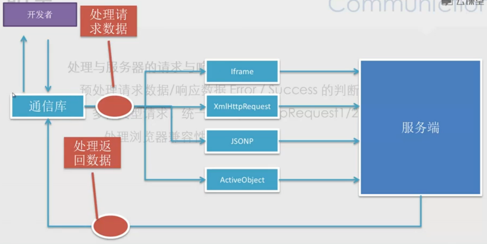

**Reqwest 技术方案**

优点：

- JSONP支持
- 稳定/IE6+ support
- CORS 跨域
- Promise/A 支持

**qwest 技术方案**

优点：

- 更小的代码量
- 支持XmlHttpRequest2
- CORS跨域
- 支持高级数据类型，如：ArrayBuffer/ Blob 等

**socket.io 技术方案**

对实时性要求非常要的可以用这个框架，如IM类产品

优点：

- 实时性
- 支持二进制数据流
- 只能自动的回退支持（非二进制数据流）
- 杜仲后端语言支持

#### Utility （Lang）

函数增强 & shim / Flow Control

**职责**

- 提供原生JS不提供的功能
- 方法门面包装，使其更易于使用
- 异步队列/流程控制等等

**Shim（保证实现与规范一致）技术方案**

- es5-shim（部分支持）
- Github:es-shims/es5-shim
- size:53k

- es6-shim（部分支持）
- Github:paulmillr/es6-shim
- size:38k
	
**Extension 技术方案**

- underscore
- size:16.5k
- 兼容：IE6+

- Lodash
- size:50k
- 兼容:IE6+
- Lodash是underscore的高性能版本，方法大部分都是runtime编译出来的

#### Templating 模板

String-based / Dom-based / Living Template

**String-based 基于字符串的模板**

通过字符串生成DOM之后就不再变化

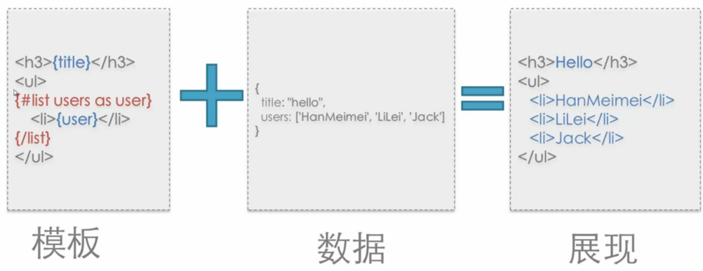

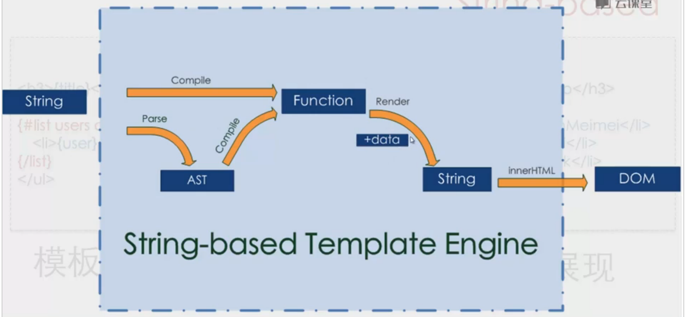

**DOM-based 基于DOM的模板**

修改数据后，Dom的展现会随时变化，并且是局部改变

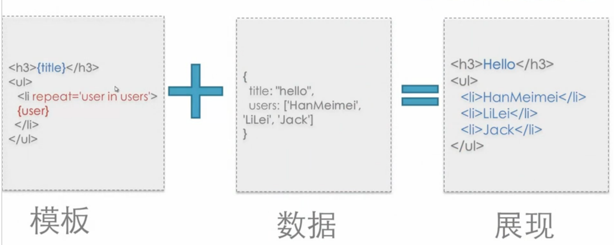

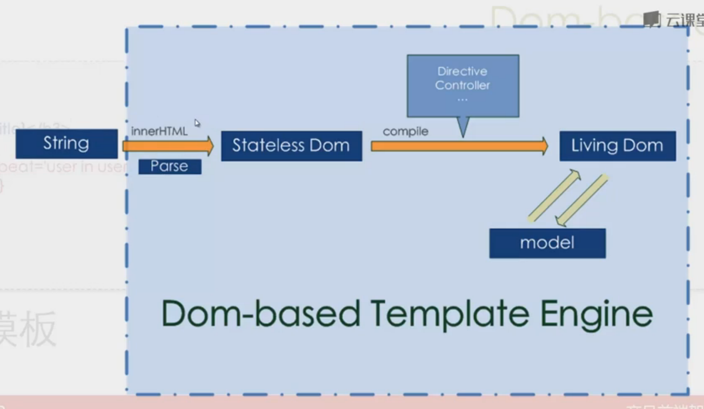

**Living-template 模板**

Living-template 是上面两种String-based和DOM-based的结婚。

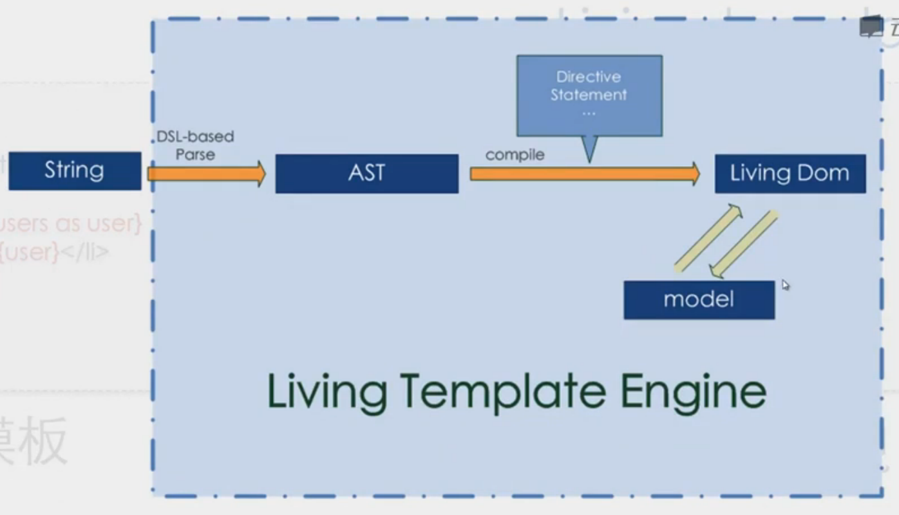

**对比**

- dust.js 性能高，体积小
- Angularjs 非常火热的技术

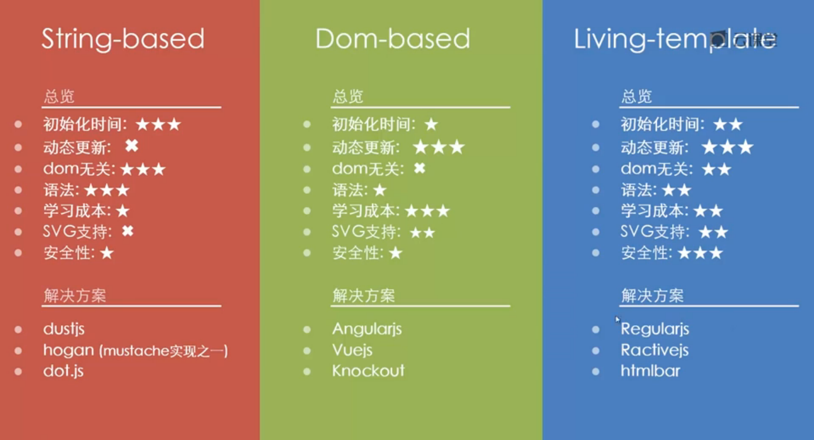

#### Component 组件

Modal / Slider / DatePicker / Tabs / Editor

**职责**

- 提供基础组件CSS支持
- 提供常用组件，如Slide，Modal
- 提供声明式的调用方式（Optional）

**Bootstrap 技术方案**

**Foundation 技术方案**

**对比**

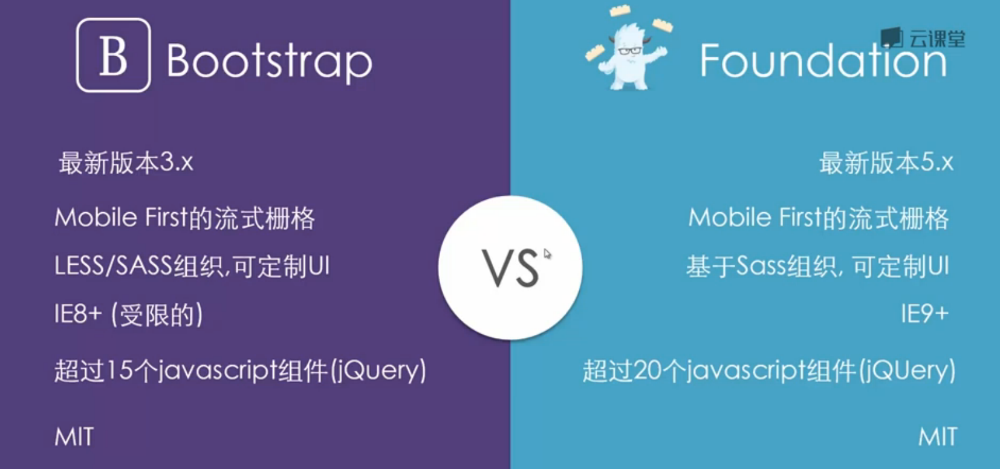

**非jQuery版本的Bootstrap**

- knockout-Bootstrap 
- AngularJS-Bootstrap
- React-Bootstrap

#### Routing 路由

Client Side / Server Side

**职责**

- 监听url变化，并通知注册的模块
- 通过javascript进行主动跳转
- 历史管理
- 对目标浏览器的兼容性支持

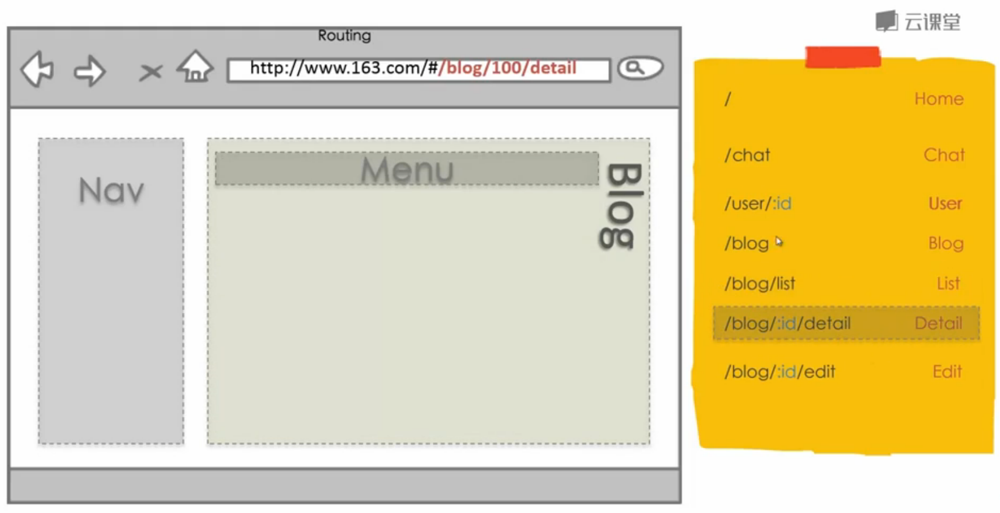

**page.js 技术方案**

- size:6.2k
- 兼容：IE8+
- Desc:类似Express.Router的路由规则的前端路由库

**Director.js**

- size:10k
- 兼容：IE6+
- Desc:可以前后端使用一套规则来定义路由

**Stateman**

- size:10k
- 兼容：IE6+
- Desc:用于处理深层复杂路由的独立路由库

**crossroad.js**

- size:7.5k
- 兼容：IE6+
- Last update: 2 year
- Desc:老牌Routing库，AIP定义较为繁琐

#### Architecture 解耦

MVC / MVVM / MV*

**职责**

- 提供一种范式帮助（强制）开发者进行模块解耦
- 视图与模型分离
- 更容易进行单元测试
- 更容易实现应用程序的拓展

**MVMM 技术架构**

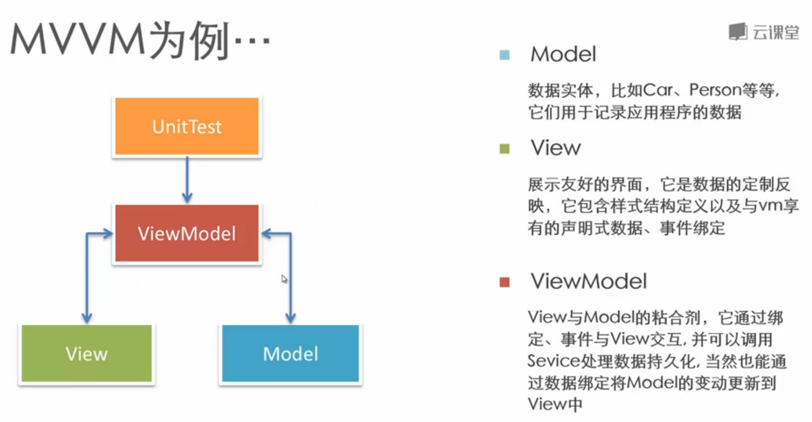

NOTE：MV* != SPA（单页系统）

加入了路由的MVMM：

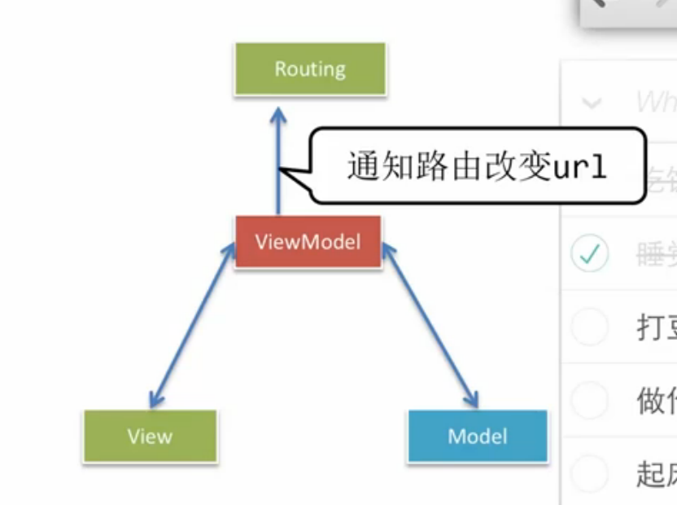

NOTE：单页系统的普适法则：可定位的应用程序状态都应该统一由路由系统进入，以避免网状的信息流。

NOTE：可以上[TodoMVC](http://todomvc.com)上选择最适合你的一种MVC架构

**其他参考网站**

- [http://www.javascripting.com](http://www.javascripting.com)

- [http://www.javascriptoo.com](http://www.javascriptoo.com)

- [http://microjs.com](http://microjs.com)

